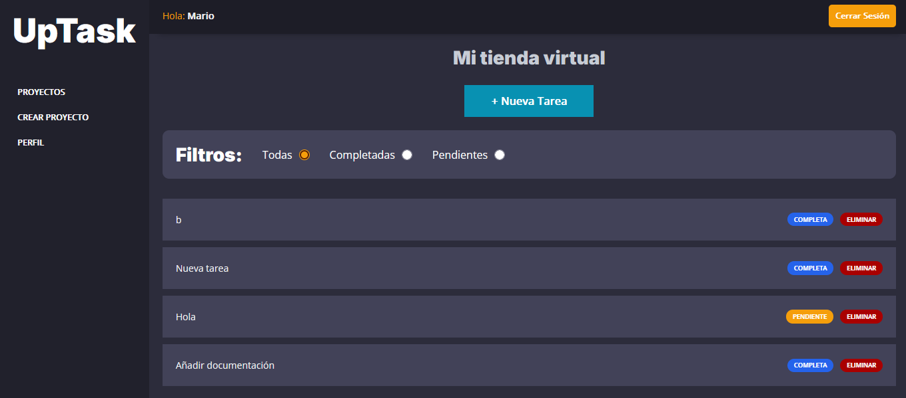
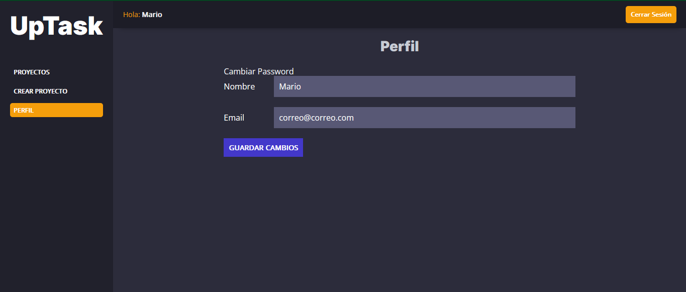

# UpTask 🚀

UpTask es una página web diseñada para crear proyectos y gestionar tareas de manera eficiente. 📝✨

## Características principales 🌟

- **Gestión de proyectos y tareas:** Organiza tus proyectos y tareas de forma sencilla.
- **Dark Mode:** Interfaz adaptable con modo oscuro para una experiencia visual cómoda. 🌙
- **Recuperación de contraseña:** Permite agregar una vieja contraseña para generar una nueva. 🔒

## Imagenes :sunrise_over_mountains:

## Tecnologías utilizadas 🛠️

- **SASS:** Para estilos modernos y mantenibles.
- **JavaScript:** Para interactividad en el cliente.
- **PHP:** Para la lógica del servidor.
- **MySQL:** Como base de datos para almacenar información.

---

¡Gracias por usar UpTask! 💻
